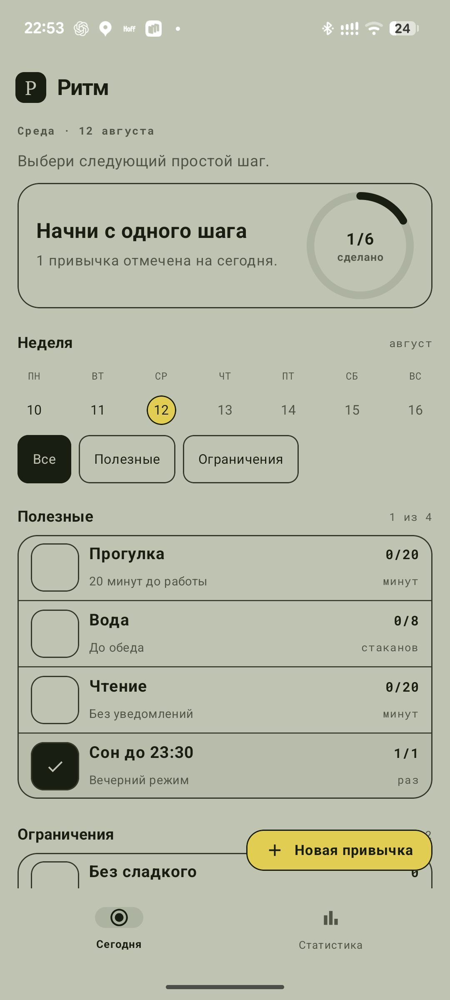
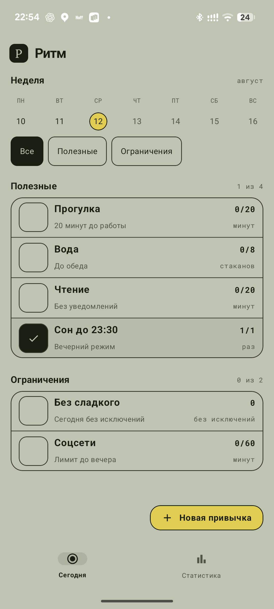
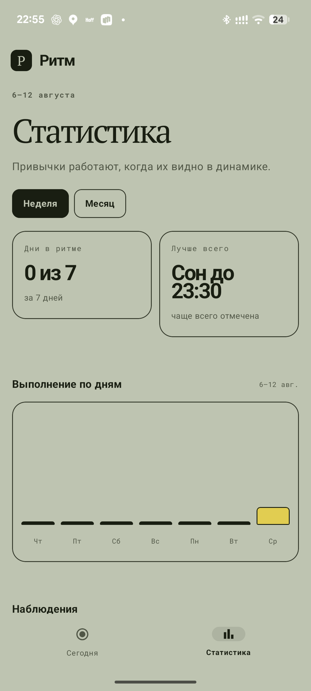

# Ритм

Нативное Android-приложение для трекинга привычек: полезные действия («Прогулка», «Вода», «Чтение») и ограничения («Без сладкого», «Соцсети») — в одном списке, с реальной статистикой по дням.

## Скриншоты

<p float="left">
  
  
  
</p>

## Возможности

- **Два типа привычек**: полезные (цель — выполнить не меньше N раз/минут) и ограничения (лимит — не превысить N раз/минут за день).
- **Количественный прогресс**: степпер +/- и ручной ввод числа вручную для привычек с целью больше 1.
- **Ограничения закрываются сами**: в конце дня приложение проверяет, не превышен ли лимит, засчитывает день и присылает push-уведомление с итогом.
- **Неделя пролистывается свайпом**: полоса дней показывает календарную неделю Пн–Вс, свайп влево/вправо переключает недели (не дальше текущей).
- **Статистика**: дни в ритме, самая стабильная привычка, график выполнения по дням за неделю/месяц — всё считается из реальной истории в Room, а не захардкожено.
- **Свайп для удаления** привычки с подтверждением.

## Стек

- **Kotlin** + **Jetpack Compose** (Material 3)
- Архитектура: **MVI** (State / Intent / Effect на каждый экран) поверх мультимодульного Gradle-проекта
- **Room** — единственный источник данных (никакого localStorage/SharedPreferences)
- **Hilt** — DI между модулями
- **Navigation-Compose** с типизированными маршрутами
- **AlarmManager** + `BroadcastReceiver` — полуночная финализация ограничений и push через `NotificationCompat`
- Шрифты — **PT Serif** и **Roboto Mono** через Google Fonts (Downloadable Fonts)

## Структура модулей

```
core/mvi           — базовые классы MVI-паттерна (UiState/UiIntent/UiEffect/MviViewModel)
core/model         — доменные модели
core/database       — Room: сущности, DAO, база
core/data           — репозиторий, посев стартовых данных
core/designsystem   — цвета, типографика, форма
core/ui             — переиспользуемые компоненты (бренд-бар, нижняя навигация, кольцо прогресса)
core/navigation     — типизированные маршруты между фичами
feature/splash      — заставка
feature/today       — главный экран: список привычек, неделя, добавление/степпер/удаление
feature/statistics  — статистика
app                 — DI-граф, NavHost, уведомления
```

Правило зависимостей: `feature:*` не знает о других `feature:*` — переходы идут через `core:navigation`. Room не «протекает» выше `core:data`.

## Сборка

```bash
export JAVA_HOME="/Applications/Android Studio Preview.app/Contents/jbr/Contents/Home"
export ANDROID_HOME="$HOME/Library/Android/sdk"
./gradlew assembleDebug
./gradlew installDebug
```

Минимальный SDK — 26, целевой/компилируемый — 37.
